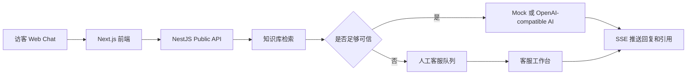

# Customer Service AI Platform

一个面向企业客服场景的多租户智能客服平台。系统同时提供访客聊天入口、AI 自动应答、知识库管理、人工客服工作台、工单处理和运营管理后台。

项目采用前后端分离的 Monorepo 结构：

- 前端：Next.js + React，提供登录、访客聊天、客服工作台和管理后台。
- 后端：NestJS，提供认证、对话、AI 编排、客服、管理员和健康检查 API。
- 数据层：PostgreSQL + Prisma；Redis 和 MinIO 由 Docker Compose 提供基础设施。
- AI：默认使用 Mock Provider，也支持 OpenAI-compatible 接口。

## 项目能做什么

### 访客侧

- 创建访客会话并获得签名的访客 Token。
- 发送问题并接收 AI 回复。
- 通过 SSE 接收流式字符、引用来源和人工接管事件。
- 在 AI 无法可靠回答时转入人工客服队列。

### AI 客服

- 从租户知识库中检索相关内容。
- 在回答中返回引用片段，便于追溯答案来源。
- 默认提供 Mock AI，便于本地演示和测试。
- 可切换到 OpenAI-compatible Provider，连接 OpenAI 或兼容接口。
- 当命中“人工”“转人工”“投诉”等关键词，或检索置信度过低时，自动触发人工接管。

### 人工客服工作台

- 查看待接管和已分配会话。
- 认领会话、回复访客、关闭会话。
- 从会话创建工单并设置优先级。
- 通过实时事件向访客推送人工回复。

### 管理后台

- 上传、查看和重建知识库索引。
- 配置机器人 Provider、模型和人工接管阈值。
- 查看团队成员、运营分析和审计日志。
- 使用 JWT 登录和基于角色的权限控制。

## 工作流程



## 技术栈

| 层级 | 技术 |
| --- | --- |
| 前端 | Next.js 15、React 19、TypeScript、Tailwind CSS、Zustand、TanStack Query |
| API | NestJS 10、TypeScript、Swagger、Passport JWT |
| 数据库 | PostgreSQL、Prisma 5 |
| 缓存/对象存储 | Redis、MinIO |
| AI | Mock Provider、OpenAI-compatible Chat Completions |
| 工程化 | pnpm workspace、Turborepo、Vitest、Playwright、Docker Compose、Nginx |

## 目录结构

```text
.
├── apps/
│   ├── api/                    # NestJS API、Prisma schema、种子数据和单元测试
│   └── web/                    # Next.js 前端、客服工作台、管理后台和 E2E 测试
├── packages/
│   └── shared/                 # 前后端共享类型和常量
├── docs/
│   ├── api/                    # API 文档
│   ├── legal/                  # 隐私政策、服务条款、数据保留策略
│   ├── runbooks/               # 部署、备份、排障和安全检查手册
│   └── user-manual/            # 访客、客服和管理员使用手册
├── infra/
│   ├── docker/                 # PostgreSQL、Redis、MinIO、API、Web、Nginx 编排
│   └── nginx/                  # Nginx 配置
├── scripts/                    # 自检、验收、备份、恢复和部署脚本
├── package.json                # Monorepo 根脚本
├── pnpm-workspace.yaml
└── turbo.json
```

## 快速开始

### 环境要求

- Node.js 20+
- pnpm 9+
- Docker Desktop 或 Docker Engine + Compose

### 安装依赖

```bash
git clone https://github.com/Caser-86/customer-service-ai-platform.git
cd customer-service-ai-platform
pnpm install
```

### Docker Compose 启动基础设施

PowerShell：

```powershell
Copy-Item infra/docker/.env.example infra/docker/.env
# 编辑 infra/docker/.env，至少设置 JWT_SECRET 和数据库种子账号密码
docker compose --env-file infra/docker/.env -f infra/docker/docker-compose.yml up -d --build
```

Linux/macOS：

```bash
cp infra/docker/.env.example infra/docker/.env
# 编辑 infra/docker/.env，至少设置 JWT_SECRET 和数据库种子账号密码
docker compose --env-file infra/docker/.env -f infra/docker/docker-compose.yml up -d --build
```

服务启动后：

- Web：<http://localhost:3000>
- API：<http://localhost:3001/api>
- Swagger：<http://localhost:3001/api/docs>
- API 存活检查：<http://localhost:3001/api/health/live>
- API 就绪检查：<http://localhost:3001/api/health/ready>

### 本地开发

确保 PostgreSQL、Redis 和必要环境变量已准备好后，可以运行：

```bash
pnpm dev
```

也可以分别启动：

```bash
pnpm --filter @cs/api dev
pnpm --filter @cs/web dev
```

常用检查命令：

```bash
pnpm build
pnpm lint
pnpm typecheck
pnpm test
pnpm e2e
pnpm self-check
pnpm acceptance
```

### 数据库和种子数据

API 使用 Prisma。首次初始化数据库时，可在 `apps/api` 目录执行：

```bash
npx prisma generate
npx prisma db push
npx prisma db seed
```

种子脚本会创建：

- 默认租户：`default`
- 管理员账号：默认邮箱为 `admin@example.com`
- 客服账号：默认邮箱为 `agent@example.com`
- 默认机器人配置
- 一份 FAQ 知识库文档

管理员和客服密码由 `ADMIN_PASSWORD`、`AGENT_PASSWORD` 环境变量提供，请勿把真实密码提交到仓库。

## 环境变量

核心配置包括：

| 变量 | 说明 |
| --- | --- |
| `DATABASE_URL` | PostgreSQL 连接串 |
| `REDIS_URL` | Redis 连接串 |
| `JWT_SECRET` | JWT 签名密钥，生产环境必须使用随机强密钥 |
| `VISITOR_TOKEN_SECRET` | 访客 Token 签名密钥，至少 16 个字符，生产环境必须修改 |
| `LLM_PROVIDER` | `mock` 或 `openai-compatible` |
| `LLM_API_KEY` | OpenAI-compatible API 密钥 |
| `LLM_API_BASE` | Chat Completions API 地址 |
| `LLM_MODEL` | 使用的模型名称 |
| `PORT` | API 端口，默认 `3001` |
| `NEXT_PUBLIC_API_URL` | 前端访问 API 的地址 |

可参考：

- [根目录环境变量示例](.env.example)
- [Docker 环境变量示例](infra/docker/.env.example)

## API 入口

API 全局前缀为 `/api`，主要分组如下：

| 分组 | 示例接口 | 用途 |
| --- | --- | --- |
| Auth | `POST /api/auth/login` | 登录并获取 JWT |
| Public | `POST /api/public/conversations` | 创建访客会话 |
| Public | `POST /api/public/conversations/:id/messages` | 发送访客消息 |
| Public | `GET /api/public/conversations/:id/events` | 订阅 SSE 事件 |
| Agent | `GET /api/agent/inbox` | 获取客服收件箱 |
| Agent | `POST /api/agent/conversations/:id/claim` | 认领会话 |
| Agent | `POST /api/agent/conversations/:id/tickets` | 创建工单 |
| Admin | `POST /api/admin/knowledge/documents` | 上传知识库文档 |
| Admin | `GET /api/admin/analytics/overview` | 查看分析数据 |
| Health | `GET /api/health/ready` | 检查依赖服务状态 |

完整接口说明见 [API 文档](docs/api/api-documentation.md)。

## 前端页面

- `/login`：登录页
- `/chat`：访客聊天页
- `/agent`：客服工作台
- `/admin/knowledge`：知识库管理
- `/admin/bot`：机器人配置
- `/admin/team`：团队管理
- `/admin/analytics`：分析报表
- `/admin/audit`：审计日志

## 当前实现边界

- 当前 `VectorSearchService` 使用内容关键词匹配和简单分数排序；Prisma schema 中虽然预留了 `vector(1536)` 字段，但当前代码还不是完整的 Embedding 向量检索实现。
- Mock Provider 主要用于演示和测试；接入真实模型时，需要配置 API 密钥、地址和模型，并将机器人 Provider 设置为 `openai-compatible`。
- 当前仓库没有可见的 `apps/api/prisma/migrations` 目录。首次初始化可使用 `prisma db push`；如果后续采用正式迁移流程，需要补充 migration 文件后再使用 `prisma migrate deploy`。
- `apps/api/src/config/config.schema.ts` 要求 `VISITOR_TOKEN_SECRET`。使用 Docker Compose 时，请确认该变量也被注入 API 容器，而不仅仅写在环境文件中。
- 生产部署前应替换示例密钥、管理员密码、MinIO 默认凭据，并重新检查 CORS、Nginx、备份和数据保留策略。

## 相关文档

- [API 文档](docs/api/api-documentation.md)
- [访客手册](docs/user-manual/visitor-manual.md)
- [客服手册](docs/user-manual/agent-manual.md)
- [管理员手册](docs/user-manual/admin-manual.md)
- [部署手册](docs/runbooks/deployment.md)
- [生产检查清单](docs/runbooks/production-checklist.md)
- [故障排查](docs/runbooks/troubleshooting.md)
- [隐私政策](docs/legal/privacy-policy.md)
- [服务条款](docs/legal/terms-of-service.md)

## License

仓库当前未在根目录提供明确的许可证文件。若要公开分发或用于商业部署，请先补充并确认许可证。
